# TrustDyne: AI-Driven Serverless Firmware Security Platform

## Executive Summary

New government laws force hardware makers to secure their code. The UK PSTI Act completely changed the legal rules for these device manufacturers. Companies face massive fines for shipping hidden software flaws. Small startups simply cannot afford expensive human security audits. They need a fast method to spot bugs before releasing new products. 
**TrustDyne** solves this exact problem using a custom dual **AI** and **ML** system. 

The platform reads raw device firmware to instantly find dangerous memory mistakes. I trained a specialized machine learning engine using **Amazon SageMaker** to act as the primary security brain. Finding the bug is only the first step. I then integrated **Amazon Bedrock** so a second generative **AI** model can translate those specific technical errors into plain English. Founders get a clear compliance report they actually understand. They know exactly what to fix to avoid breaking the law.

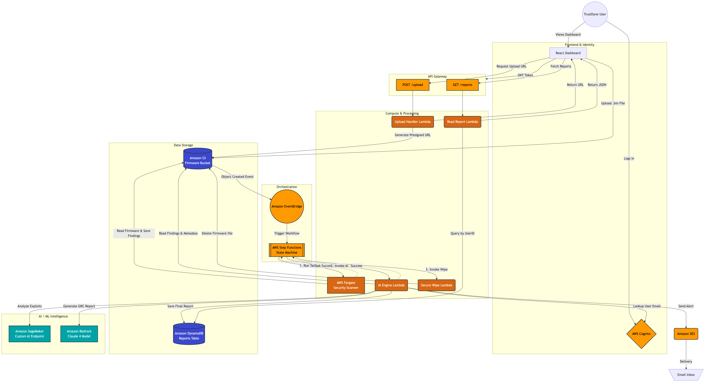

## 2. Infrastructure as Code: The Secure Foundation

Clicking around the AWS console manually introduces massive security risks. Human error can easily expose a private database to the open internet.

I built the entire TrustDyne cloud network using **Terraform**. Writing the infrastructure as code ensures the environment deploys exactly the same way every time. This setup constructs a highly secure **Amazon VPC** completely from scratch. I designed strict subnetting rules to keep the custom **AI** models completely hidden. These machine learning engines live deep inside private networks. They only communicate with the outside world through carefully configured **NAT Gateways**. 

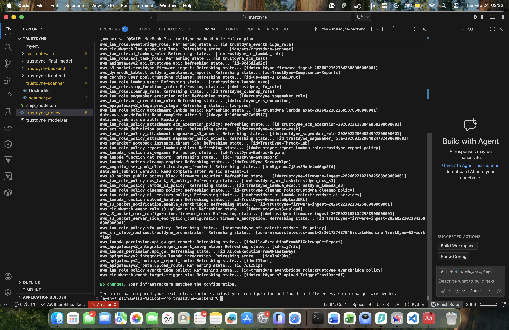

The Terraform code automatically provisions all the necessary storage and database layers. It creates the **Amazon S3** buckets to hold the raw firmware uploads. It sets up the **Amazon DynamoDB** tables to store the final compliance reports. It also builds the **Amazon API Gateway** to connect the secure backend to the public web dashboard. Real security requires strict **IAM Least Privilege** policies attached to every single cloud service. Each component only receives the exact permissions needed to finish its specific job.

Managing state files through code gives us direct financial control over our AWS bill. We can spin up the whole architecture in minutes and destroy it instantly to stop paying for idle servers.

## 3. The Custom Security Brain: Model Training and Selection

Many companies just send their private code to public services like ChatGPT. That creates a massive security risk for sensitive firmware.

I decided to build a completely custom **AI** engine from scratch. This keeps all client files strictly inside our secure cloud environment. I started with a compact open-source base model containing 1.1 billion parameters. A smaller model runs much faster and costs significantly less to host. I used **Amazon SageMaker** to teach this generic model how to spot software bugs. I fed the system thousands of known code vulnerabilities from the official NIST SARD database. 

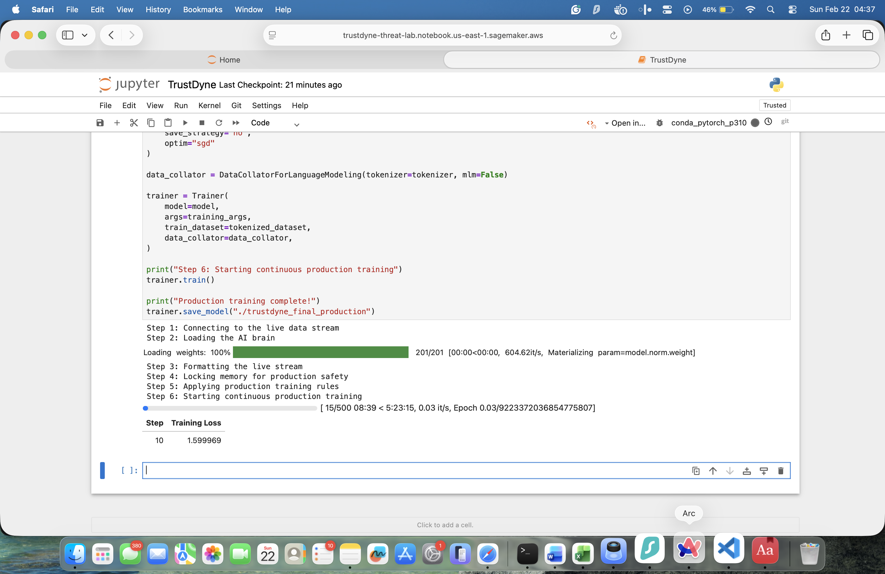

I also included the CodeAlpaca dataset to improve how the **ML** system reads logic. I strictly verified that all training data used open-source licenses to prevent legal issues. Training massive neural networks usually requires incredibly expensive computer chips. I bypassed this financial roadblock by using an algorithm called Low-Rank Adaptation. This specific math technique freezes the main brain of the model. It only updates a tiny fraction of the memory pathways during the **SageMaker** training phase.

The final result is a highly accurate security scanner that uses very little memory. It spots exact code flaws without relying on expensive outside services.

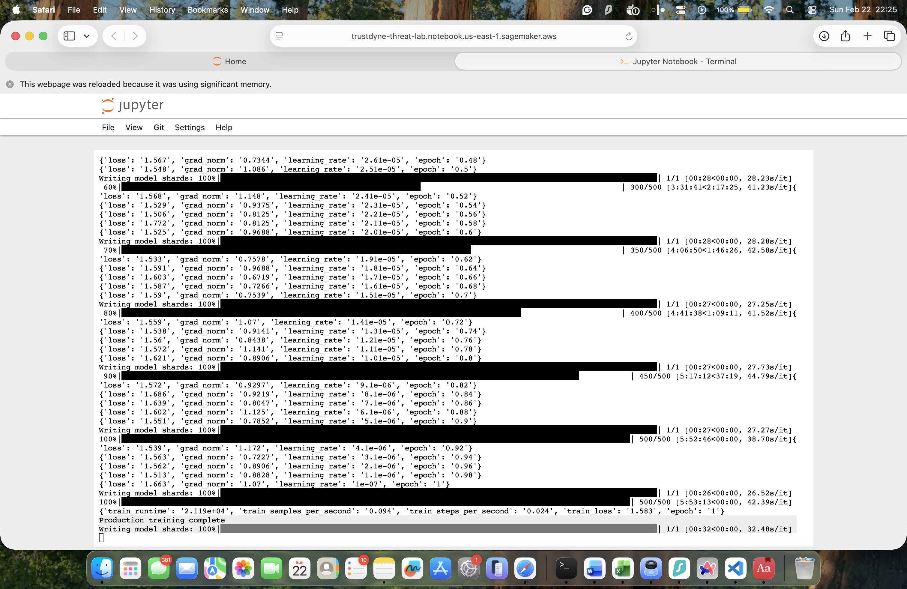

## 4. Serverless Orchestration: The Automated Pipeline

Writing one giant Python script to control an application creates terrible risks. A single tiny error can crash the entire system entirely.

I avoided this trap by using **AWS Step Functions** to act as the master traffic director. This cloud service manages the whole **AI** workload step by step. The scanning journey begins the second a user uploads a new firmware file. That file lands safely inside a locked **Amazon S3** bucket. That specific upload action wakes up the automated workflow. The system immediately routes the raw data into an isolated **AWS Fargate** container. 

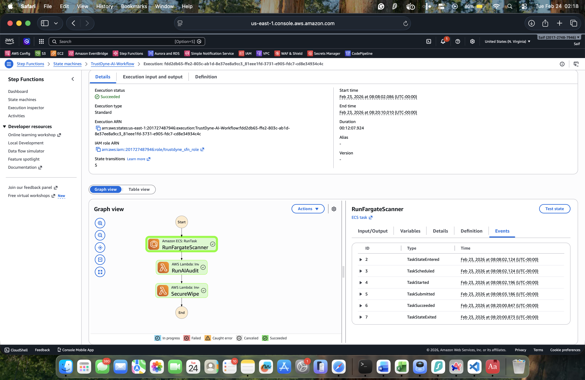

This container serves as a highly secure quarantine zone. It unpacks the client code without ever exposing the main servers to potential viruses. Using a visual state machine prevents bad traffic jams. The platform easily processes hundreds of heavy **ML** tasks at the exact same time.

This *completely serverless* design acts as a perfect financial shield. You only pay for the exact seconds the computer actually runs.

## 5. Backend Operations: The FastAPI Layer

The custom **ML** brain needs a fast way to communicate with the rest of the application. I built the main backend server using **Python** and a framework called FastAPI.

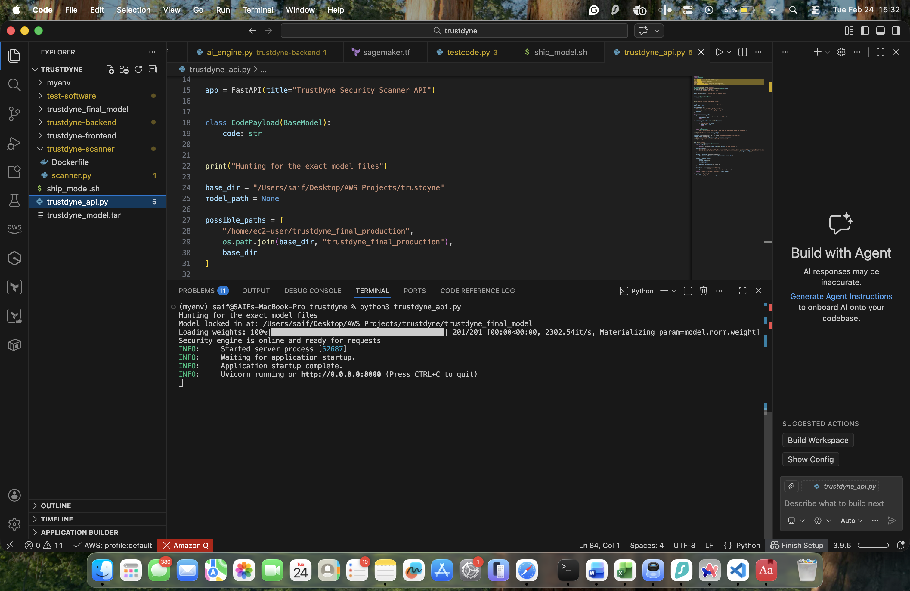

This specific setup is perfect for handling heavy artificial intelligence workloads. The server boots up and immediately loads the trained weights directly from an **Amazon S3** bucket. Keeping the **AI** model actively loaded in memory means it does not have to restart for every single file. It can read thousands of lines of raw firmware code in just milliseconds. 

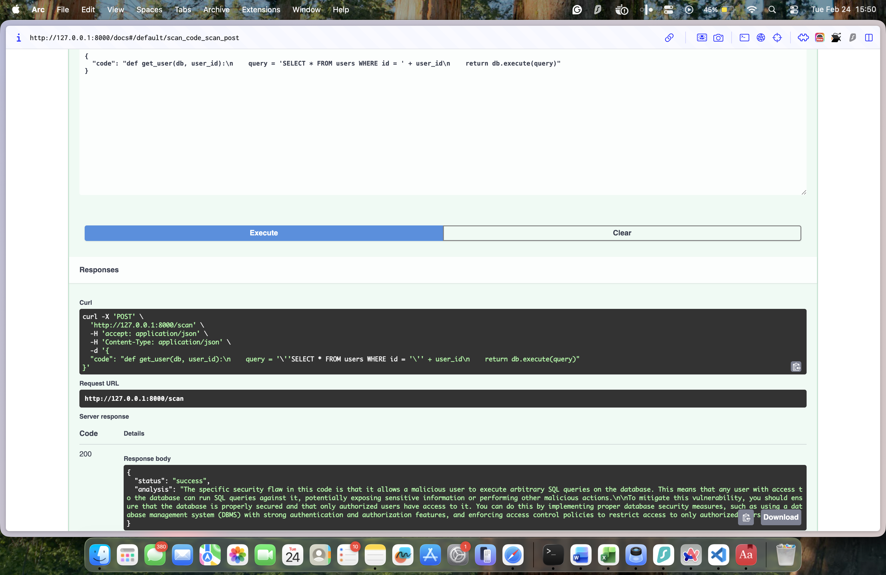

Hardware companies often upload massive batches of files all at once. Standard servers usually freeze or crash when they receive too much data unexpectedly. I connected this FastAPI backend directly to an **Amazon API Gateway**. This cloud network component automatically balances the incoming web traffic and handles the heavy load.

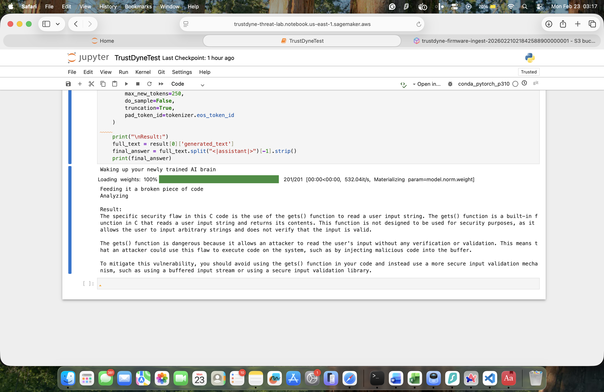

The server never gets overwhelmed by sudden spikes in user activity. The machine learning engine scans the code smoothly and prepares the raw data for the final translation phase.

## 6. Generative AI Integration: The Legal Translator

Raw technical data confuses most business owners. A memory leak means nothing to a CEO trying to pass a strict government audit.

I needed a way to translate those complex code flaws into plain English. I integrated **Amazon Bedrock** to handle this crucial communication step. The system routes the raw threat data from our custom **ML** brain directly into the Claude 3 model. I engineered very strict instructions to control this specific generative **AI**. These exact rules force the model to map the technical bugs directly to the UK PSTI Act. 

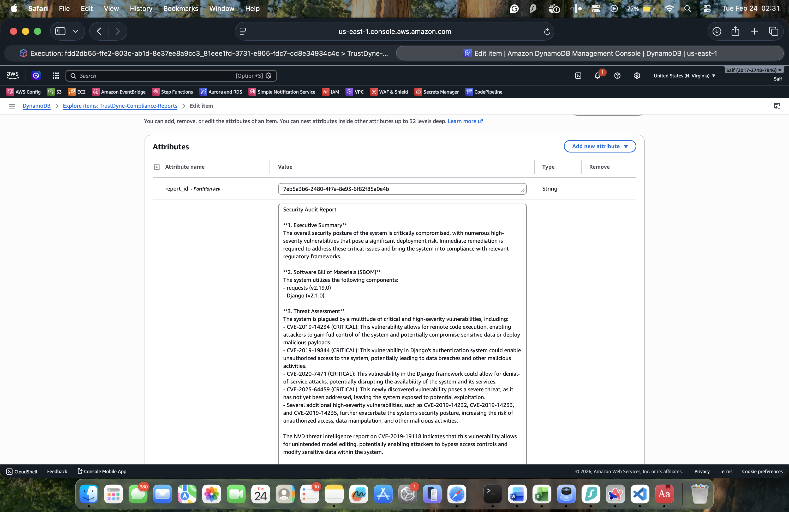

It simply cannot make up fake laws or guess compliance rules. The final plain English report tells the founder exactly how to fix the device. I chose **Amazon DynamoDB** to store these completed reports securely.

This specific database handles massive amounts of text instantly. It retrieves the final legal analysis the second a user clicks their dashboard.

## 7. The User Experience: Dashboard and Delivery

Business owners need a simple way to upload their files. I built the visual frontend using **React** to keep the experience completely frictionless.

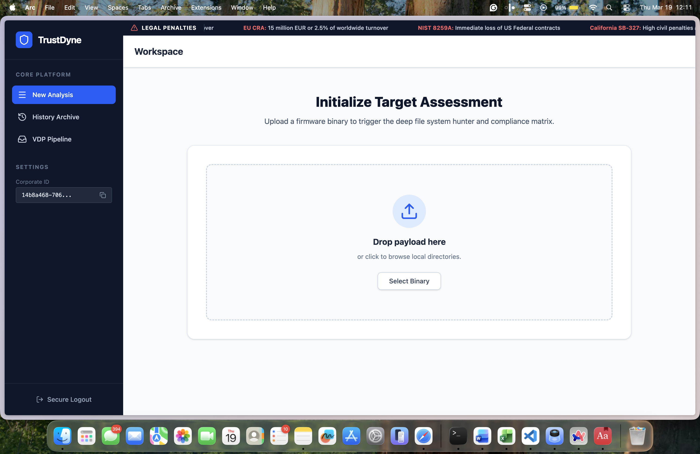

Users just drag their firmware onto the screen and wait for the results. The dashboard talks directly to the cloud network to fetch the final compliance grade. Security remains the absolute top priority after the scan finishes. An automated script immediately triggers a total data wipe.

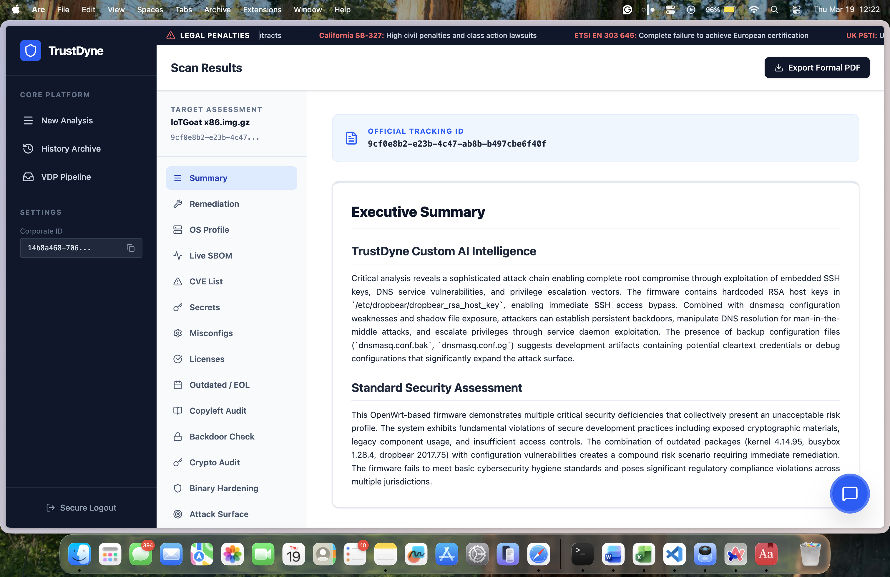

The system permanently deletes the private client code from the storage buckets. Nothing gets left behind on our servers.

## 8. Interactive Context: The AI Firmware Assistant

Analyzing raw security reports usually requires deep technical knowledge. I built a dedicated AI chatbot directly into the dashboard to translate complex data into everyday English.

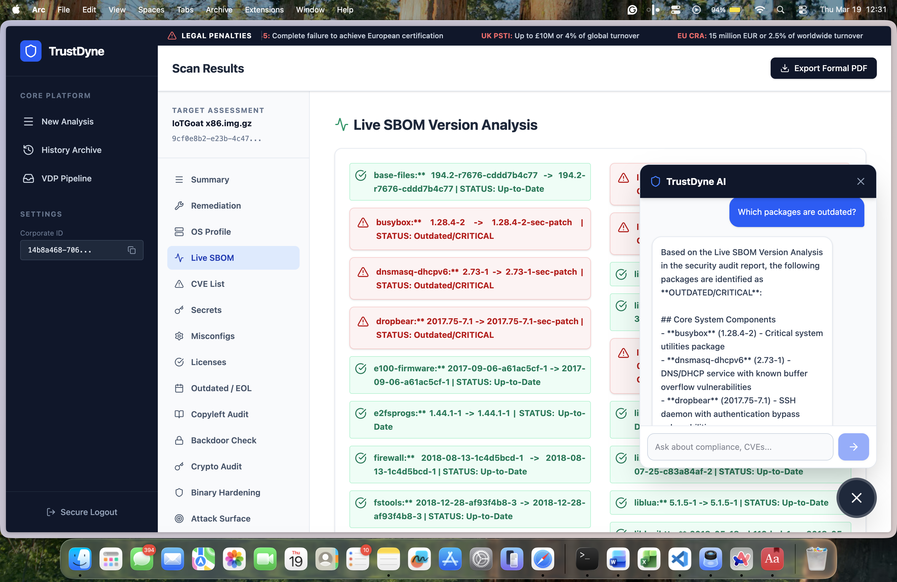

Users can ask absolutely anything about their firmware scan results. The integrated chat feature uses **Amazon Bedrock** to instantly explain hidden vulnerabilities or compliance failures.

Checking a Software Bill of Materials often takes hours of manual work. A user can simply ask the assistant to review their live SBOM version analysis. 

The AI will immediately flag critical outdated packages and explain the exact risks involved in plain text. This gives engineering teams immediate context right when they need it.

## 9. Secure Delivery: Zero-Retention Notifications

Emailing vulnerability reports directly creates a massive security loophole. Attackers could intercept these messages and read the exact flaws hidden in the hardware.

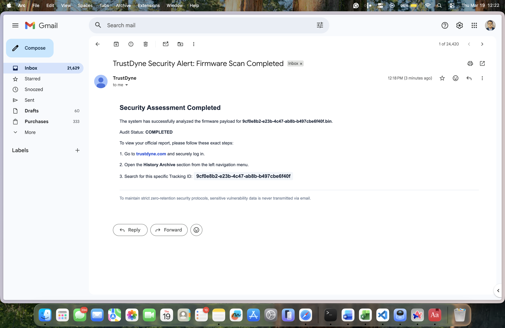

I implemented a strict zero-retention notification system. When a firmware scan finishes, the system sends a simple alert indicating the audit is complete.

The email only contains a unique Tracking ID and secure login instructions. Users must authenticate properly into the TrustDyne platform to view their sensitive data.

## 10. Automated Remediation: Auto-Fix Scripts

Identifying a problem is only half the battle. Developers need immediate solutions to patch the discovered vulnerabilities quickly.

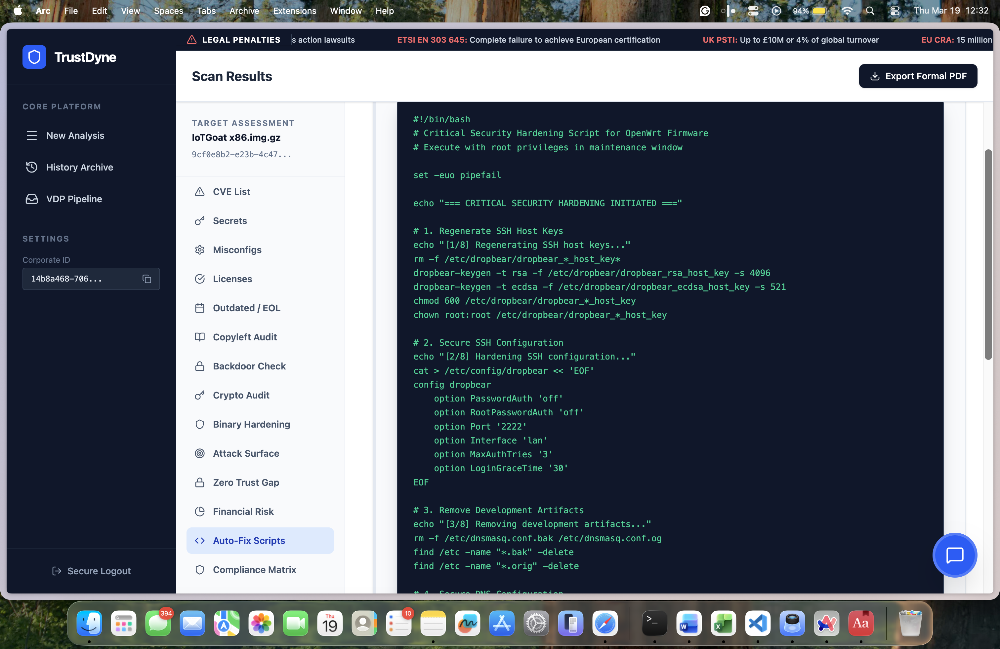

I engineered the platform to generate custom auto-fix scripts based on the exact scan results. The system outputs ready-to-use Bash scripts for critical security hardening.

These scripts handle complex tasks like regenerating SSH host keys and removing dangerous development artifacts automatically. This allows engineering teams to deploy secure updates in minutes instead of days.

## Live Demonstration Notice

The core application logic remains locked in a private repository to protect the intellectual property. The visual proof above shows the complete and working cloud architecture. Please request a live private demonstration to see the full **AI** scanning engine in action.

## 🧠 Challenges & Lessons Learned
* **AI Hallucinations in Compliance Logic:** Initially, the custom AI engine generated false positives when evaluating strict ISO 27001 controls. I overcame this by refining the prompt engineering and introducing a multi-pass verification step before the final report generation.
* **AWS Step Functions Complexity:** Coordinating multiple serverless tasks (data ingestion, AI analysis, email notification) led to race conditions. I learned to implement strict state machine error handling and retry logic within Step Functions to ensure robust execution.
